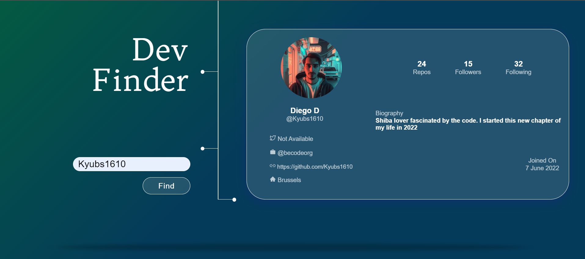

# DevFinder

I add to reproduce a picture from a figma board and create a mobile/desktop version for a "developer finder" using the API of Github

It was a really nice challenge that I made in 2-3 days. 

[Link here](https://ama-devfinder.netlify.app/)

